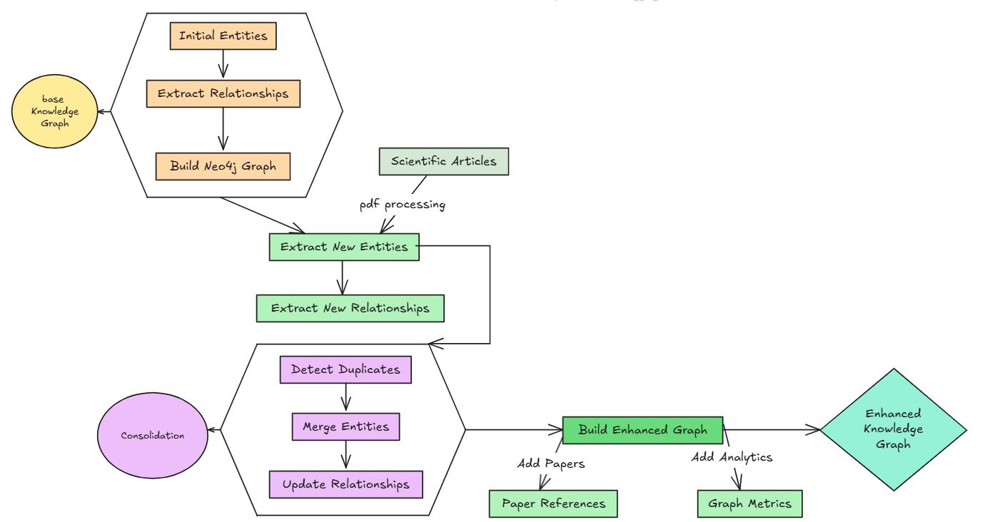

Knowledge Graph Enhancement
============================

The knowledge graph enhancement process involves expanding the existing knowledge base by extracting additional entities and relationships from RL scientific articles.

.. note::
View the complete implementation in Google Colab: Open Notebook `Knowledge Graph Notebook <https://colab.research.google.com/github/MasrourTawfik/Textra_research_v1/blob/main/docs/notebooks/kg_enhancement.ipynb>`_

Enhancement Strategy
---------------------

Knowledge Graph Enhancement Flow

The enhancement process follows these key principles:

1. **Consistency Preservation**: New entities must conform to existing type and layer classifications
2. **Incremental Updates**: Existing entities are enhanced rather than overwritten
3. **Source Attribution**: All new knowledge is linked to its source articles
4. **Quality Control**: Strict validation of entity types and properties

Scientific Article Processing
=============================

Implementation Details
----------------------

1. **Initialization**

Setting up the extractor with valid types and layers:

.. code-block:: python

    def __init__(self, api_key: str = None):
        self.client = OpenAI(
            base_url="https://integrate.api.nvidia.com/v1",
            api_key=api_key
        )
        self.valid_types = {
            'theorem', 'equation', 'framework', 'concept', 
            'method', 'policy_based', 'value_based', 'hybrid',
            'algorithm', 'variant', 'improvement', 'base_algorithm',
            'domain', 'benchmark', 'field'
        }
        self.valid_layers = {
            'foundation', 'theoretical', 'algorithmic', 'implementation'
        }

2. **Article Text Extraction**

Processing PDF articles to extract text content:

.. code-block:: python

    def extract_pdf_text(self, pdf_path: str) -> str:
        try:
            with open(pdf_path, 'rb') as file:
                reader = PyPDF2.PdfReader(file)
                text = ""
                for page in reader.pages:
                    text += page.extract_text() + "\n"
                return text
        except Exception as e:
            print(f"Error reading PDF {pdf_path}: {e}")
            return ""

3. **Entity Prompt Engineering**

Structured prompt for consistent entity extraction:

.. code-block:: python

    def create_extract_prompt(self, text: str, article_reference: str) -> str:
        type_options = "|".join(self.valid_types)
        layer_options = "|".join(self.valid_layers)
        
        return f"""Extract key reinforcement learning entities from this scientific article.
Focus on identifying concepts, methods, or algorithms while maintaining consistency with existing knowledge organization.

Format as JSON:
{{
    "entities": [
        {{
            "id": "unique_snake_case_id",
            "name": "Full Name",
            "type": "{type_options}",
            "definition": "Clear, precise definition under 50 words",
            "properties": [
                {{
                    "name": "layer",
                    "value": "{layer_options}"
                }},
                {{
                    "name": "scientific_paper",
                    "value": "{article_reference}"
                }}
            ]
        }}
    ]
}}"""

4. **Entity Update Management**

Careful handling of entity updates:

.. code-block:: python

    def update_entity(self, new_entity: Dict, article_reference: str) -> Dict:
        entity_id = new_entity['id']
        
        if entity_id in self.existing_entities:
            existing = self.existing_entities[entity_id]
            
            # Add new properties while preserving layer
            for prop in new_entity.get('properties', []):
                if prop['name'] == 'layer':
                    continue  # Keep original layer
                if prop['name'] not in existing_props:
                    existing['properties'].append(prop)
            
            return existing
        else:
            # Ensure new entity has required structure
            if 'properties' not in new_entity:
                new_entity['properties'] = []
            
            # Add default layer if missing
            has_layer = any(p['name'] == 'layer' for p in new_entity['properties'])
            if not has_layer:
                new_entity['properties'].append({
                    'name': 'layer',
                    'value': 'algorithmic'
                })
            
            return new_entity

5. **Batch Processing**

Processing multiple articles and updating the knowledge graph:

.. code-block:: python

    def process_articles_directory(self, articles_dir: str, output_file: str):
        articles_path = Path(articles_dir)
        all_new_entities = {}
        
        for pdf_file in articles_path.glob("*.pdf"):
            article_data = self.process_article(str(pdf_file))
            if article_data and 'entities' in article_data:
                all_new_entities.update(article_data['entities'])
        
        # Merge with existing knowledge
        merged_entities = {**self.existing_entities, **all_new_entities}
        
        # Create updated knowledge graph
        updated_knowledge = {
            'entities': merged_entities,
            'metadata': {
                'total_entities': len(merged_entities),
                'new_entities_added': len(all_new_entities)
            }
        }
        
        return updated_knowledge

Relationship Enhancement
=========================

After enhancing the knowledge graph with new entities from scientific articles, we implement a layered relationship extraction process to identify connections between new and existing entities.

Implementation Details
----------------------

1. **Layer Classification System**

Each entity is classified into a hierarchical layer:

.. code-block:: python

    def determine_layer(self, entity_data: Dict) -> str:
        if 'type' in entity_data:
            entity_type = entity_data['type'].lower()
            
            if entity_type in ['theorem', 'equation', 'principle', 'proof']:
                return 'foundation_layer'
            elif entity_type in ['value_based', 'policy_based', 'model_based']:
                return 'method_layer'
            elif entity_type in ['algorithm', 'base_algorithm', 'variant']:
                return 'algorithm_layer'
            elif entity_type in ['field', 'benchmark', 'use_case']:
                return 'application_layer'
        
        return 'foundation_layer'

2. **Layer-Aware Prompt Engineering**

Relationships are extracted considering layer hierarchy:

.. code-block:: python

    def create_relationship_prompt(self, entity_id: str, entity: Dict, 
                                 all_entities: Dict) -> str:
        source_layer = self.determine_layer(entity)
        entities_by_layer = {
            'foundation_layer': [],
            'method_layer': [],
            'algorithm_layer': [],
            'application_layer': []
        }
        
        # Group potential target entities by layer
        for eid, e in all_entities.items():
            if eid != entity_id:
                layer = self.determine_layer(e)
                entities_by_layer[layer].append({
                    'id': eid,
                    'name': e['name'],
                    'type': e.get('type', '')
                })

3. **Directional Relationship Types**

Relationships are categorized by their direction:

- **up**: Connections to higher layers (e.g., foundation to method)
- **down**: Connections to lower layers (e.g., algorithm to foundation)
- **same**: Within-layer relationships (e.g., algorithm to algorithm)
- **across**: Cross-layer non-hierarchical relationships

4. **Statistical Analysis**

Tracking relationship statistics:

.. code-block:: python

    layer_statistics = {
        'foundation_layer': {'total': 0, 'connected': 0},
        'method_layer': {'total': 0, 'connected': 0},
        'algorithm_layer': {'total': 0, 'connected': 0},
        'application_layer': {'total': 0, 'connected': 0}
    }

    layer_connections = {
        'up': sum(1 for rel in new_relationships if rel['direction'] == 'up'),
        'down': sum(1 for rel in new_relationships if rel['direction'] == 'down'),
        'same': sum(1 for rel in new_relationships if rel['direction'] == 'same'),
        'across': sum(1 for rel in new_relationships if rel['direction'] == 'across')
    }

5. **Integration Process**

Merging new relationships with existing ones:

.. code-block:: python

    def extract_relationships(self, updated_kg_file: str, output_dir: str):
        # Identify new entities
        new_entities = {
            entity_id: entity 
            for entity_id, entity in updated_entities.items()
            if entity_id not in self.original_entities
        }

        # Process only new entities
        new_relationships = []
        for entity_id, entity in new_entities.items():
            # Extract relationships using LLM
            completion = self.client.chat.completions.create(
                model="nvidia/llama-3.1-nemotron-70b-instruct",
                messages=[{
                    "role": "user", 
                    "content": self.create_relationship_prompt(
                        entity_id, entity, updated_entities
                    )
                }],
                temperature=0.3
            )

        # Combine and deduplicate
        all_relationships = self.existing_relationships + new_relationships
        unique_relationships = self.remove_duplicates(all_relationships)

6. **Output Structure**

Final relationship data format:

.. code-block:: json

    {
        "relationships": [
            {
                "source": "entity_id",
                "source_layer": "layer_name",
                "target": "target_entity_id",
                "target_layer": "layer_name",
                "type": "relationship_type",
                "direction": "up|down|same|across"
            }
        ],
        "metadata": {
            "total_relationships": 0,
            "new_relationships_added": 0,
            "layer_statistics": {},
            "layer_connections": {
                "up": 0,
                "down": 0,
                "same": 0,
                "across": 0
            }
        }
    }

Entity Consolidation
====================

The entity consolidation phase focuses on identifying and merging duplicate entities while preserving all relevant information and maintaining relationship integrity. This process ensures a clean, non-redundant knowledge graph.

Implementation Details
----------------------

1. **Duplicate Detection**

The system uses strict criteria for identifying duplicates:

.. code-block:: python

    def create_duplicate_detection_prompt(self, entities: Dict) -> str:
        entities_list = []
        for entity_id, entity in entities.items():
            entities_list.append({
                "id": entity_id,
                "name": entity["name"],
                "type": entity["type"],
                "definition": entity.get("definition", "")
            })

        return f"""Analyze these entities and identify ONLY EXACT duplicate concepts.
        Return the response as clean JSON without any markdown formatting.

        STRICT GUIDELINES:
        1. Only group entities that are literally the same thing
        2. DO NOT group variants or improvements 
        3. DO NOT group general concepts with specific implementations
        4. If unsure, DO NOT group them
        5. Mark any uncertain groups with "REMOVED" in the reason"""

2. **Validation Rules**

Strict validation to prevent incorrect merges:

.. code-block:: python

    def validate_merge_group(self, group: Dict) -> bool:
        # Skip if marked as removed
        if "REMOVED" in group['reason'].upper():
            return False
            
        # Skip if mentions specific concepts
        skip_keywords = ['variant', 'improvement', 'extension', 
                        'specific', 'implementation', 'enhancement']
        
        if any(keyword in group['reason'].lower() 
               for keyword in skip_keywords):
            return False
            
        return True

3. **Entity Merging Process**

Careful merging of duplicate entities:

.. code-block:: python

    def merge_entities(self, entity_groups: List[Dict], entities: Dict) -> Dict:
        merged_entities = entities.copy()
        
        for group in valid_groups:
            main_id = group['main_id']
            main_entity = merged_entities[main_id]
            merged_definitions = set([main_entity.get('definition', '')])
            merged_properties = main_entity.get('properties', [])
            merged_papers = set()
            
            for dup_id in group['duplicate_ids']:
                self.id_mapping[dup_id] = main_id
                
                if dup_id in merged_entities:
                    dup_entity = merged_entities[dup_id]
                    
                    # Merge definitions and properties
                    merged_definitions.add(dup_entity['definition'])
                    for prop in dup_entity.get('properties', []):
                        if prop not in merged_properties:
                            merged_properties.append(prop)

4. **Relationship Update**

Maintaining relationship integrity after merging:

.. code-block:: python

    def update_relationships(self, relationships_data: Dict) -> Dict:
        updated_relationships = []
        seen = set()
        
        for rel in relationships_data.get('relationships', []):
            source = self.id_mapping.get(rel['source'], rel['source'])
            target = self.id_mapping.get(rel['target'], rel['target'])
            
            # Create unique key for relationship
            rel_key = (source, target, rel['type'])
            
            if rel_key not in seen:
                seen.add(rel_key)
                rel_copy = rel.copy()
                rel_copy['source'] = source
                rel_copy['target'] = target
                updated_relationships.append(rel_copy)

5. **Output Format**

The consolidated knowledge graph format:

.. code-block:: json

    {
        "entities": {
            "entity_id": {
                "name": "Entity Name",
                "type": "entity_type",
                "definition": "Combined definitions",
                "properties": [
                    {
                        "name": "property_name",
                        "value": "property_value"
                    }
                ]
            }
        },
        "metadata": {
            "original_count": 0,
            "final_count": 0,
            "duplicates_merged": 0,
            "merge_groups": []
        }
    }

Key Features
-------------

1. **Strict Duplicate Detection**:
   - Exact match requirements
   - Variant exclusion
   - Implementation differentiation

2. **Safe Merging**:
   - Definition preservation
   - Property combination
   - Paper reference maintenance

3. **Relationship Integrity**:
   - ID mapping
   - Relationship deduplication
   - Direction preservation

4. **Quality Control**:
   - Validation checks
   - Keyword filtering
   - Uncertain group removal

Consolidated Graph Building
============================

The final phase involves building an enhanced Neo4j graph from the consolidated knowledge base, including scientific paper references and improved metadata.

Implementation Details
----------------------

1. **Node Creation**

Enhanced node creation with paper references:

.. code-block:: python

    def create_node(self, tx, entity_id, entity_data):
        # Prepare node properties
        node_props = {
            'id': entity_id,
            'name': entity_data['name'],
            'type': entity_data['type'],
            'definition': entity_data['definition'],
            'domains': entity_data.get('domains', []),
            'properties': properties_list,
            'scientific_papers': [p['value'] for p in entity_data.get('properties', []) 
                                if p.get('name') == 'scientific_paper']
        }

        # Handle different node types
        if entity_data['type'].lower() == 'domain':
            query = """
            MERGE (n:Domain {id: $id})
            SET n = $node_props
            """
        else:
            query = f"""
            MERGE (n:Concept:{type_label} {{id: $id}})
            SET n = $node_props
            """

2. **Paper References**

Creating paper nodes and relationships:

.. code-block:: python

    # Create paper nodes and relationships
    if node_props['scientific_papers']:
        for paper in node_props['scientific_papers']:
            paper_query = """
            MERGE (p:Paper {id: $paper_id})
            SET p.name = $paper_id
            WITH p
            MATCH (n)
            WHERE n.id = $entity_id
            MERGE (n)-[r:REFERENCED_IN]->(p)
            """
            tx.run(paper_query, paper_id=paper, entity_id=entity_id)

3. **Relationship Processing**

Enhanced relationship creation with type cleaning:

.. code-block:: python

    def create_relationships(self, tx, relationships_data):
        for rel in relationships:
            # Clean relationship type
            rel_type = rel['type'].upper()\
                .replace(' ', '_')\
                .replace('(', '')\
                .replace(')', '')\
                .replace('-', '_')\
                .replace('.', '_')\
                .replace(':', '_')
            
            query = f"""
            MATCH (source)
            WHERE source.id = $source
            MATCH (target)
            WHERE target.id = $target
            MERGE (source)-[r:{rel_type}]->(target)
            SET r.source_layer = $source_layer
            SET r.target_layer = $target_layer
            SET r.direction = $direction
            """

4. **Index Creation**

Comprehensive indexing strategy:

.. code-block:: python

    def create_indices(self, tx):
        queries = [
            "CREATE INDEX concept_type_idx IF NOT EXISTS FOR (n:Concept) ON (n.type)",
            "CREATE INDEX concept_name_idx IF NOT EXISTS FOR (n:Concept) ON (n.name)",
            "CREATE INDEX concept_id_idx IF NOT EXISTS FOR (n:Concept) ON (n.id)",
            "CREATE INDEX domain_id_idx IF NOT EXISTS FOR (n:Domain) ON (n.id)",
            "CREATE INDEX domain_name_idx IF NOT EXISTS FOR (n:Domain) ON (n.name)",
            "CREATE INDEX paper_id_idx IF NOT EXISTS FOR (n:Paper) ON (n.id)"
        ]

5. **Metadata Enhancement**

Adding graph analytics:

.. code-block:: python

    def add_metadata(self, tx):
        queries = [
            """
            MATCH (n)
            WHERE n:Concept OR n:Domain
            SET n.degree = COUNT {(n)--()}
            """,
            """
            MATCH (n)
            WHERE n:Concept OR n:Domain
            SET n.in_degree = COUNT {(n)<--()}
            """,
            """
            MATCH (n)
            WHERE n:Concept OR n:Domain
            SET n.out_degree = COUNT {(n)-->()}
            """
        ]

Key Features
-------------

1. **Enhanced Node Types**:
   - Concept nodes with dynamic typing
   - Domain nodes for categorization
   - Paper nodes for scientific references
   - Property lists with scientific papers

2. **Relationship Types**:
   - Standard concept relationships
   - Paper reference relationships
   - Layer-aware connections
   - Directional metadata

3. **Performance Optimization**:
   - Strategic index creation
   - Type-specific indices
   - Name and ID indexing
   - Paper reference indexing

4. **Graph Analytics**:
   - Degree centrality
   - In-degree measurement
   - Out-degree measurement
   - Connection statistics

Usage Example
--------------

Building the complete consolidated graph:

.. code-block:: python

    def main():
        ENTITIES_FILE = "consolidated_knowledge_graph.json"
        RELATIONSHIPS_FILE = "consolidated_relationships.json"
        
        graph = ConsolidatedGraphBuilder()
        try:
            graph.build_graph(ENTITIES_FILE, RELATIONSHIPS_FILE)
        finally:
            graph.close()

