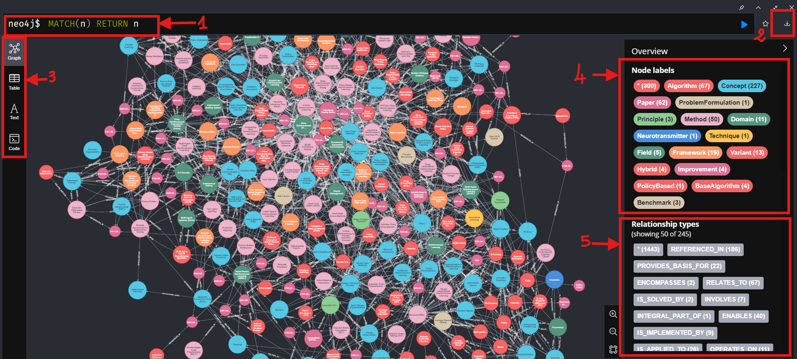

Building and Exploring the Reinforcement Learning Knowledge Graph
==================================================================

Overview
---------

Our knowledge graph represents mappings of the RL field , encompassing:
- 227 Core Concepts
- 67 Distinct Algorithms
- 82 Research Papers
- 50+ Methodological Approaches
- 19 Frameworks
- 13 Algorithm Variants
- Multiple Specialized Domains

.. figure:: ../Images/graph.png
    :align: center
    :alt: Knowledge Graph Overview
Knowledge Graph Overview

This visualization reveals the dense interconnections between different elements of reinforcement learning.

Neo4j Knowledge Graph Interface: A Visual Guide
-----------------------------------------------

   Neo4j Knowledge Graph Interface showing the main components and visualization tools

Interface Components
~~~~~~~~~~~~~~~~~~~~

1. NEO4J Query Bar
   * Where Cypher queries are entered to interact with the graph database
   * Currently showing "MATCH(n) RETURN n" which displays all nodes

2. Export Tools
   * Provides export functionality in multiple formats:
     - JSON
     - PNG
     - SVG
     - CSV

3. Left Sidebar Tools
   * Graph: Visual graph view selector
   * Properties View: Displays detailed node and relationship properties in JSON format
   * Text: Text view option
   * Code: Code view selector

4. Node Labels Panel
   * Displays all node types with their respective counts
   * Color-coded categories including:
     - Concept: 227 nodes
     - Algorithm: 67 nodes
     - Paper: 82 nodes
   * Contains 15 distinct node types

5. Relationship Types Panel
   * Shows relationship varieties between nodes
   * Displays 50 out of 245 total relationship types
   * Key relationships include:
     - REFERENCED_IN (186 instances)
     - PROVIDES_BASIS_FOR (22 instances)

Domain and Field Exploration
-----------------------------

.. figure:: domains.png
   :alt: Neo4j Query for Domains and Fields
   :align: center

   Cypher query showing domain and field nodes in the knowledge graph

The knowledge graph includes various specialized domains and fields where reinforcement learning has been applied. These can be explored using the following Cypher query:

.. code-block:: cypher

   MATCH (n) 
   WHERE n.type IN ['domain', 'field'] 
   RETURN n 
   ORDER BY n.type, n.name

Domain Structure Example: IoT Security
~~~~~~~~~~~~~~~~~~~~~~~~~~~~~~~~~~~~~~

IoT Security provides an exemplary case of domain representation in our knowledge graph:
.. figure:: domain.png
   :alt: IoT Security Node's properties
   :align: center

   IoT Security Node's properties
* **Definition**: The practice of protecting Internet of Things (IoT) devices, networks, and data from unauthorized access, use, disclosure, disruption, modification, or destruction.
* **Connectivity**: 
  - Total connections (degree): 10
  - Incoming connections (in_degree): 3
  - Outgoing connections (out_degree): 7
* **Properties**:
  - Layer: foundation
  - Key contribution: Critical for maintaining user trust and preventing vulnerabilities in IoT systems
  - Scientific backing: Referenced in paper 2102.07247

Key Application Domains
~~~~~~~~~~~~~~~~~~~~~~~

Technical Domains
^^^^^^^^^^^^^^^^^^
* **IoT Security**
* **Multi-Agent Systems (MAS)**
* **Autonomous Braking System**
* **Multi-Echelon Supply Chain**

Scientific Fields
^^^^^^^^^^^^^^^^^
* **Psychology**: Intersection of reinforcement learning with cognitive science
* **Explainable AI**
* **Probabilistic Model Checking**

Emerging Applications
^^^^^^^^^^^^^^^^^^^^^^
* **Irrigation Scheduling Optimization**
* **Adversarial Machine Learning**
* **Multi-Agent Reinforcement Learning**

Algorithm Improvements 
-----------------------

.. figure:: imp.png
  :alt: Neo4j Query for Algorithm Improvements
  :align: center
  
  Query showing algorithm improvements and variations in the knowledge graph

improvements and variations can be queried using:

.. code-block:: cypher

  MATCH (n) WHERE n.type='improvement' 
  RETURN n ORDER BY n.type, n.name

Notable Improvements
~~~~~~~~~~~~~~~~~~~~

* **Generalized PUCT (GPUCT)**
 - Enhances the PUCT algorithm by replacing square root with exponential
 - Makes best constant invariant to descent numbers
 - Referenced in paper 2102.03467
 - Layer: algorithmic

* **Prioritized Replay Buffer**

* **Double Deep Q Networks (DDQNs)**

* **Quantum-Inspired Improvements**

More Knowledge Graph Node Types with examples
----------------------------------------------

Variant Analysis
~~~~~~~~~~~~~~~~
.. figure:: variants.png
  :alt: Variant Nodes Query Results
  :width: 100%
  :align: center

  Graph visualization of algorithm variants and their relationships

Querying variants using:
.. code-block:: cypher

  MATCH (n) WHERE n.type='variant' RETURN n ORDER BY n.type, n.name

Shows DQN Distillation as a key example:
- A specific application of RL distillation
- Used with DQN as teacher algorithm
- Has 9 connections (2 in, 7 out)
- Referenced in paper 1901.08128

Benchmark Exploration
~~~~~~~~~~~~~~~~~~
.. figure:: image.png
  :alt: Benchmark Nodes in Knowledge Graph
  :width: 70%
  :align: center

  Procgen Benchmark node and its connections

The Procgen Benchmark example shows:
- Purpose: Evaluates RL agents' generalization
- Layer: Implementation
- Connectivity: 9 total connections
- Key contribution: Standardized evaluation framework
- Scientific backing: Paper 2102.10330

Algorithm Structure
~~~~~~~~~~~~~~~~~~~~
.. figure:: algo.png
  :alt: Algorithm Nodes and Relationships
  :width: 100%
  :align: center

  Network of algorithm nodes showing Expected Sarsa and related algorithms

Query reveals algorithm relationships:
.. code-block:: cypher

  MATCH (n) WHERE n.type='algorithm' RETURN n ORDER BY n.type, n.name

Expected Sarsa example:
- Off-policy TD control algorithm
- Has specific update rule
- Connected to multiple variants
- Shows clear evolutionary path of algorithms

Method Analysis
~~~~~~~~~~~~~~~~
.. figure:: method.png
  :alt: Method Nodes Structure
  :width: 100%
  :align: center

  Reward Function Design method and its network of connections

Reward Function Design example:
- Definition: Process of crafting effective reward functions
- High connectivity: 17 total connections (6 in, 11 out)
- Layer: Algorithmic
- Key contribution: Balances competing objectives
- Referenced in paper 1702.02302

Paper Connections
~~~~~~~~~~~~~~~
.. figure:: paper.png
  :alt: Paper Reference Network
  :width: 100%
  :align: center

  Paper node 1702.03118 and its citation network

Example shows:
- Paper ID: 1702.03118
- Multiple REFERENCED_IN relationships
- Connects different concepts (Explainable AI, Spoken Dialogue Systems)
- Shows how papers bridge different domains