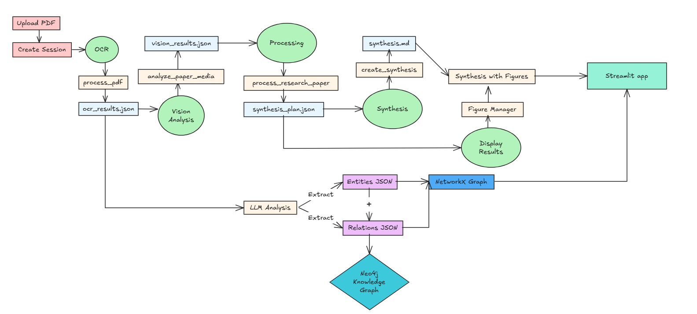
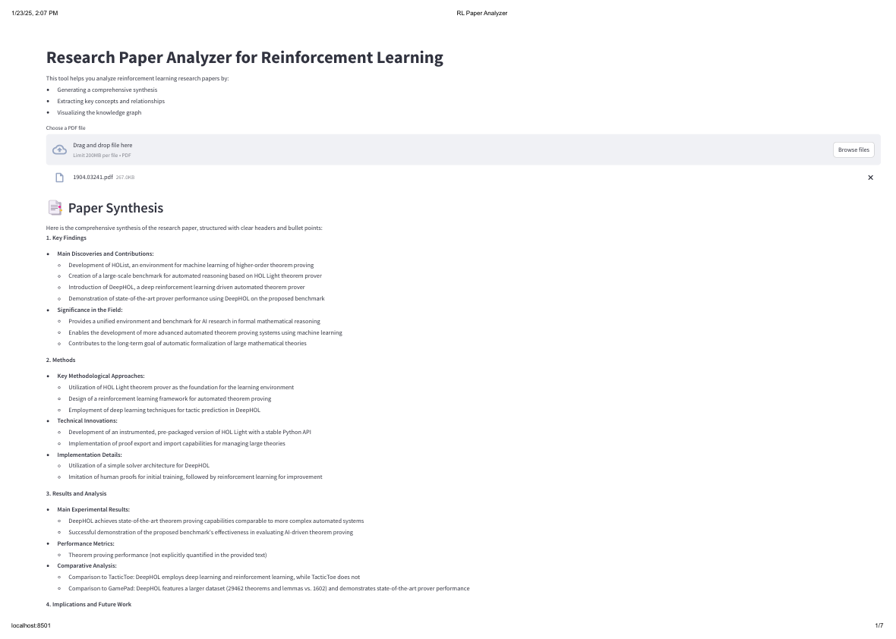
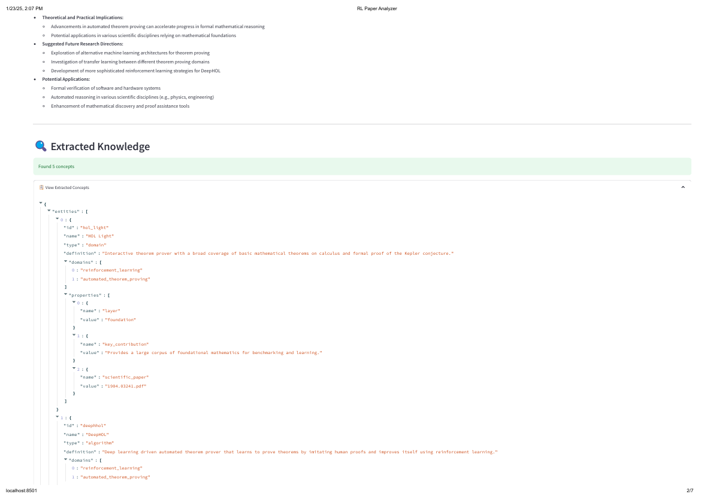
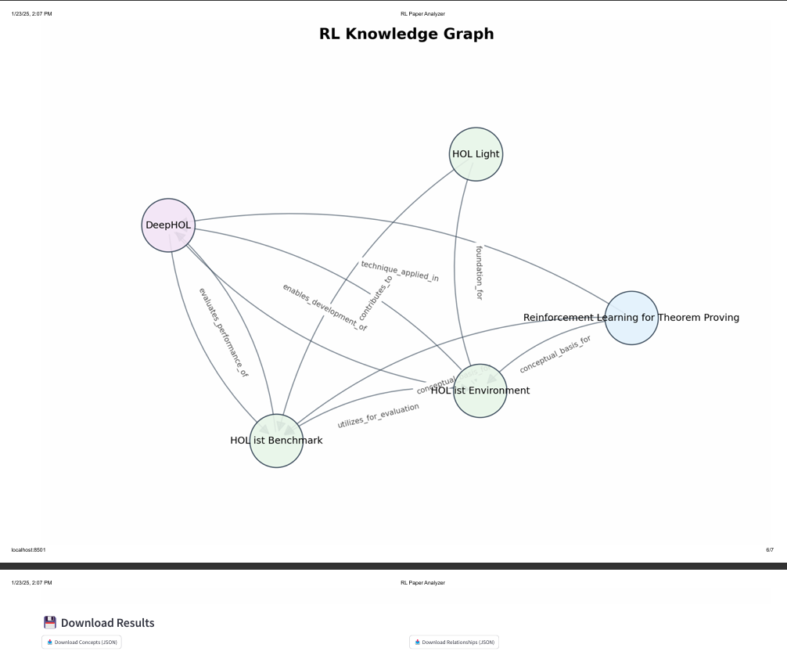
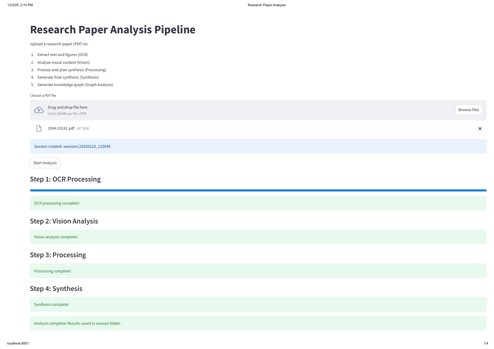
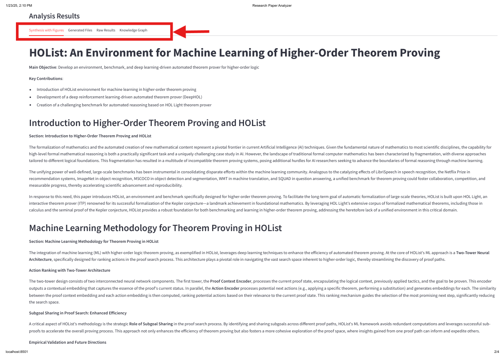
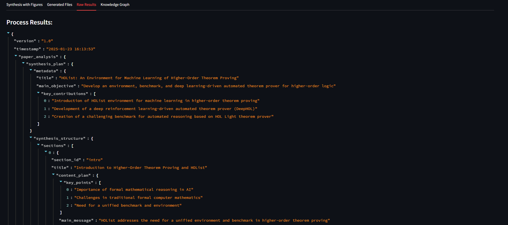
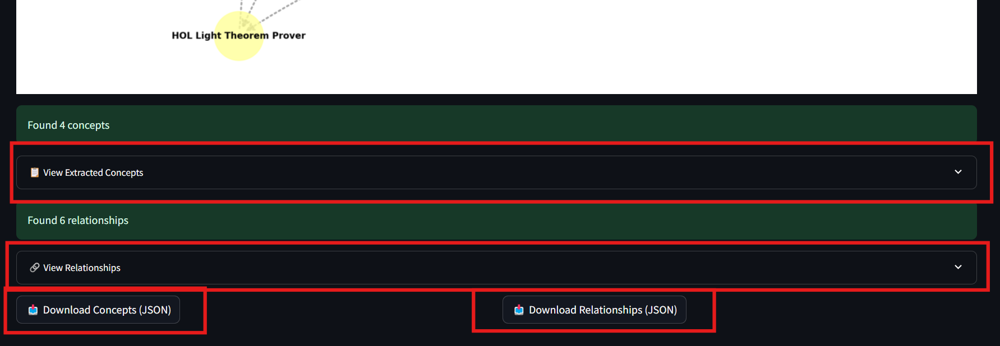

Synthesis connected Pipeline
=============================

Overview
---------
This pipeline represents the final architecture of the synthesis system, it contains multiple stages fron extraction, analyzing, and synthesizing the content of RL papers. The system combines OCR, computer vision (VLM ), natural language processing, and graph analysis to create comprehensive paper summaries and knowledge representations.

   
   Pipeline architecture showing data flow from PDF upload to final visualization
   

Pipeline Components
===================

1. OCR Processing (ocr.py)

The OCR module handles the initial document processing:

* Converts PDF documents to images using pdf2image
* Uses Tesseract OCR for text extraction
* Implements layout analysis using LayoutParser with the PubLayNet model
* Detects and extracts tables and figures from the document
* Outputs: JSON file containing page text, table locations, and figure locations

Configuration requirements:
    * Tesseract OCR installation
    * Poppler installation for PDF processing
    * PubLayNet model for layout detection

2. Vision Analysis (vision.py)
The vision module analyzes extracted visual elements:

* Uses NVIDIA AI models for image analysis
* The model used is "microsoft/phi-3.5-vision-instruct"
* Processes both tables and figures
* Extracts context from surrounding text
* Generates descriptions for visual elements
* Outputs: Enhanced JSON with visual element descriptions

API Dependencies:

* NVIDIA AI API access

* Base URL: https://integrate.api.nvidia.com/v1

3. Content Processing (processor.py)

The processor module handles the semantic analysis:

* Analyzes media items for relevance
* Creates synthesis plans
* Uses LLaMA model for content analysis
* Determines essential visual elements
* Outputs: Structured JSON with analysis results

4. Synthesis Generation (synthesis.py)

The synthesis module creates the final paper summary:

Generates section-by-section content
Integrates visual elements
Creates a cohesive narrative
Outputs: Markdown file with complete synthesis

5. Knowledge Graph Analysis (knowledge_graph.py)

The knowledge graph module creates semantic representations:

* Extracts key concepts and relationships

* Creates graph visualizations

* Uses NetworkX for graph processing

* Outputs: JSON files with graph data and PNG visualization

Integration
------------

Data Flow
~~~~~~~~~~
1. PDF → OCR Results → Vision Analysis → Processing → Synthesis
2. Knowledge graph generation occurs in parallel after processing

File Formats
~~~~~~~~~~~~
* Input: PDF files

* Intermediate: JSON files for data exchange

* Output: 
    - Markdown synthesis
    - JSON knowledge graph data
    - PNG graph visualizations

Deployment
----------

Dependencies
~~~~~~~~~~~
.. code-block:: bash

    pip install -r r.txt

Required external software:
    * Tesseract OCR
    * Poppler
    * Python 3.8+

API Configuration
~~~~~~~~~~~~~~~~~~
Set the following environment variables:
    * NVIDIA_API_KEY
    * Other API keys as needed

Usage
------

Web Interface
~~~~~~~~~~~~
Two different web interfaces are available for different use cases:

Quick Analysis Interface (app.py)
'''''''''''''''''''''''''''''''
.. code-block:: bash

    streamlit run app.py

This interface provides:
    * Summarized synthesis of the paper
    * Extraction of key entities and relationships
    * Interactive knowledge graph visualization
    * Entity and relationship downloads
    * Streamlined analysis process

   
   Initial upload and document synthesis of the quick analysis interface

   
   Paper synthesis and entity extraction view

   
  RL Paper to knowledge graph visualization 

the graph can be downloaded, as png and as json (entities.json & relationships.json)

Comprehensive Analysis Interface (main.py)
''''''''''''''''''''''''''''''''''''''''''
.. code-block:: bash

    streamlit run main.py

This interface provides:

    * Detailed, comprehensive synthesis
    * Step-by-step pipeline visualization
    * Full OCR and vision analysis results
    * In-depth figure and table analysis
    * Complete processing results and artifacts
    * Knowledge Graph

   
   Initial upload screen of the main interface

   
   Different tabs available in the interface

   
  Raw results view

   
  knowledge graph visualization and download

Customization
--------------
The pipeline can be customized through:

* Model selection in vision analysis
* Synthesis templates
* Knowledge graph parameters
* Output format modifications

