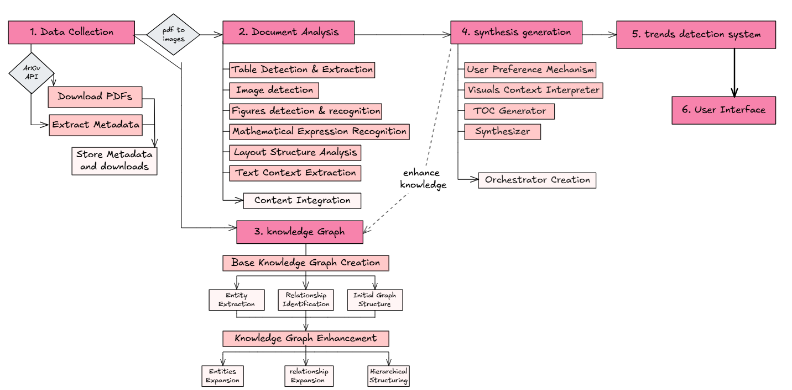

Pipeline
========

The project consists of six main phases as illustrated in the figure below:

Pipeline phases overview

1. Data Collection
-------------------
Initial phase focused on gathering PDFs using arXiv API, extracting metadata, and storing the collected information and downloads.

2. Document Analysis
---------------------
Processes the collected documents through multiple analyzers including table detection, figure detection, mathematical expression recognition, layout analysis, and text context extraction. All extracted information is integrated into a unified content representation.

3. Knowledge Graph
-------------------
The first knowledge graph that was build (base knowledge graph) using `Reinforcement Learning: an Introduction`_

.. _Reinforcement Learning\: an Introduction: https://web.stanford.edu/class/psych209/Readings/SuttonBartoIPRLBook2ndEd.pdf

Enhancement of the knowledge base by: feeding it the most cited reinforcement learning papers, from 2017 to 2024

Creates and enhances a knowledge base by:
Creating a base knowledge graph through entity extraction, relationship identification, and initial structure definition
Enhancing the graph through entity expansion, relationship expansion, and hierarchical structuring

4. Synthesis Generation
------------------------
Generates synthesized content using components like:
- User preference mechanism
- Visual context interpreter
- TOC generator
- Content synthesizer
- Orchestrator creation for managing the previous components

5. Trends Detection System
---------------------------
Analyzes the processed information to identify and extract relevant trends from the documents.

6. User Interface
------------------
Creating a simple interface where users can interact with the system and access the processed information, syntheses, and detected trends.