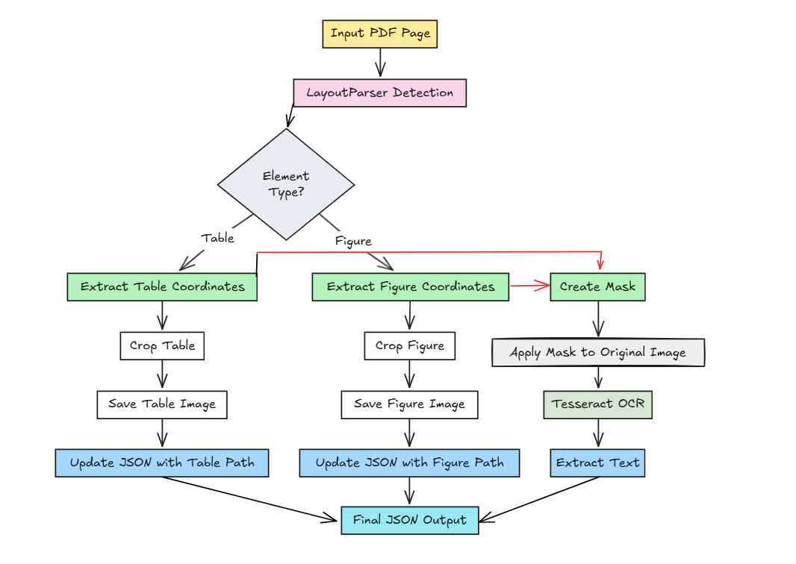

Text Extraction 
=================

.. note::
   View the complete implementation in Google Colab: `Document Layout Analysis and Text Extraction <https://colab.research.google.com/github/MasrourTawfik/Textra_research_v1/blob/main/documentation/docs/notebooks/text_extraction.ipynb>`_

Process Overview
--------------
Our approach combines LayoutParser with Tesseract OCR to achieve accurate text extraction from complex document layouts. The workflow is as follows:

Text Extraction Approach

La Démarche (Approach)
---------------------
1. **Layout Detection**: 
   - LayoutParser to identify tables and figures
   - Apply different confidence thresholds for tables (0.1) and figures (0.9)
   - Tesseract when configured is good at detecting text layout (double layout & unstructured layout)

2. **Element Extraction**:
   - Save detected tables and figures as separate images
   - Store their coordinates and paths for later reference
   - Handle overlapping detections using IoU (Intersection over Union)

3. **Text Extraction**:
   - Create masks for detected tables and figures
   - Apply Tesseract OCR only to non-masked regions
   - Use page segmentation mode 1 for automatic layout analysis

Some Implementation Components
------------------------------

1. Layout Detection
~~~~~~~~~~~~~~~~~~~

.. code-block:: python

    # Initialize Layout Parser model
    model = lp.Detectron2LayoutModel(
        'lp://PubLayNet/faster_rcnn_R_50_FPN_3x/config',
        extra_config=["MODEL.ROI_HEADS.SCORE_THRESH_TEST", min(table_threshold, figure_threshold)],
        label_map={0: "Text", 1: "Title", 2: "List", 3: "Table", 4: "Figure"}
    )

2. Mask Creation
~~~~~~~~~~~~~~~~~

.. code-block:: python

    def create_mask_for_regions(image_size, regions):
        """Create a boolean mask for regions to ignore"""
        mask = np.zeros(image_size[::-1], dtype=bool)
        
        for coords in regions:
            # Add padding around regions
            x1, y1, x2, y2 = [int(c) for c in coords]
            x1 = max(0, x1 - 5)
            y1 = max(0, y1 - 5)
            x2 = min(image_size[0], x2 + 5)
            y2 = min(image_size[1], y2 + 5)
            mask[y1:y2, x1:x2] = True
            
        return mask

3. Page Processing
~~~~~~~~~~~~~~~~~~~

.. code-block:: python

    def process_page(image_path, layout_model, output_folder, page_num, 
                    table_threshold=0.1, figure_threshold=0.9):
        """Process a single page focusing only on tables and figures"""
        # Load and process image
        image = Image.open(image_path).convert('RGB')
        
        # Detect layout
        layout = layout_model.detect(image)
        
        # Process tables and figures
        processed_regions = []
        regions_to_mask = []
        
        # Process and mask elements
        # Apply Tesseract OCR
        # Return structured results

Configuration and Usage
-----------------------

Used Parameters:
- ``table_threshold = 0.1``: Lower threshold for tables
- ``figure_threshold = 0.9``: Higher threshold for figures
- ``custom_config = '--psm 1'``: Tesseract page segmentation mode

Basic usage:

.. code-block:: python

    # Process an entire article
    article_path = Path("path/to/article/images")
    result = process_article(article_path)

Output Structure
----------------

The process generates an organized directory structure for each processed article:

.. code-block:: none

    article_name_processed/
    ├── tables/
    │   ├── table_1.png
    │   ├── table_2.png
    │   └── ...
    ├── figures/
    │   ├── figure_1.png
    │   ├── figure_2.png
    │   └── ...
    └── result.json

- ``tables/``: Contains extracted table images
- ``figures/``: Contains extracted figure images
- ``result.json``: Contains the complete analysis including text content, element coordinates, and file paths